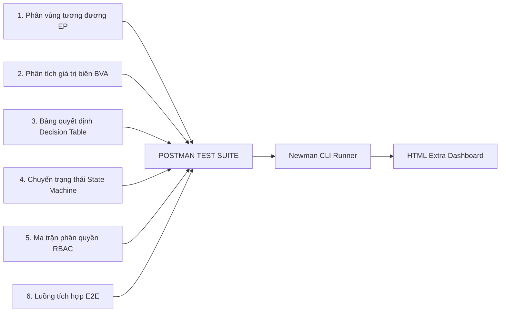

# KẾ HOẠCH KIỂM THỬ TỔNG THỂ (MASTER TEST PLAN)
**Tên dự án:** Kiểm thử Hệ thống RESTful API - Website Bán Quần Áo (Clothes Shop)  
**Môn học:** Kiểm thử phần mềm (Software Testing)  
**Công cụ kiểm thử chính:** Postman (Desktop App v10+), Newman (CLI), Node.js, MySQL  
**Phương pháp tiếp cận:** Kiểm thử Hộp đen (Black-box Testing), Kiểm thử tự động API (API Automation Testing)

---

## 1. GIỚI THIỆU & MỤC TIÊU DỰ ÁN (INTRODUCTION & OBJECTIVES)

### 1.1. Giới thiệu
Tài liệu này xác định mục tiêu, phạm vi, chiến lược, môi trường, quy trình thực thi và tiêu chí nghiệm thu cho việc kiểm thử toàn diện hệ thống RESTful API của dự án Website Bán Quần Áo. Dự án bao gồm các phân hệ người dùng (Khách hàng) và phân hệ quản trị vận hành (Admin / Staff) 

### 1.2. Mục tiêu kiểm thử (Testing Objectives)
* **Chức năng (Functional):** Xác nhận 100% các API cốt lõi hoạt động chính xác theo đặc tả kỹ thuật và nghiệp vụ kinh doanh.
* **Biên & Ràng buộc (Boundary & Validation):** Kiểm tra khả năng xử lý và phản hồi đúng đắn đối với các dữ liệu đầu vào không hợp lệ, dữ liệu ranh giới (Edge Cases), ngăn chặn crash server.
* **Bảo mật & Phân quyền (Security & Access Control):** Đảm bảo cơ chế xác thực JWT và ma trận phân quyền (RBAC: User vs Staff vs Admin) hoạt động chặt chẽ, ngăn chặn việc leo thang đặc quyền (Privilege Escalation) hoặc truy cập dữ liệu chéo.
* **Toàn vẹn dữ liệu (Data Integrity):** Kiểm tra tính nhất quán của dữ liệu tài chính, kho hàng, số lượt sử dụng voucher khi có giao dịch hoặc hủy đơn.
* **Tự động hóa (Automation):** Xây dựng bộ kịch bản tự động hóa trên Postman kết hợp với Newman CLI để xuất báo cáo kiểm thử chuyên nghiệp (HTML Dashboard).

---

## 2. PHẠM VI KIỂM THỬ (SCOPE OF TESTING)

### 2.1. Trong phạm vi (In-Scope)
Kiểm thử toàn bộ các API Endpoints thuộc các module sau:
1. **Module 1 - Xác thực & Phân quyền (`/api/auth`, `/api/users`):**
   - Đăng ký, đăng nhập, cấp phát và xác thực JWT token.
   - Quản lý tài khoản: Thông tin cá nhân, sổ địa chỉ nhận hàng.
   - Chức năng Admin: Khóa/mở khóa tài khoản (`LOCKED`/`ACTIVE`), cập nhật quyền hạn (`role`).
2. **Module 2 - Danh mục & Sản phẩm (`/api/categories`, `/api/products`):**
   - Lấy danh sách, xem chi tiết, phân trang (`page`, `limit`), tìm kiếm từ khóa, lọc theo khoảng giá, lọc theo danh mục.
   - CRUD sản phẩm và danh mục bởi Admin/Staff (kèm upload ảnh qua Multer).
3. **Module 3 - Giỏ hàng (`/api/cart`):**
   - Thêm vào giỏ hàng (theo mã SP và mã Size), cập nhật số lượng, xóa khỏi giỏ.
   - Kiểm tra ràng buộc tồn kho khi thêm vào giỏ.
4. **Module 4 - Quản lý Voucher / Giảm giá (`/api/vouchers`):**
   - Admin CRUD mã giảm giá (% hoặc số tiền cố định, thời hạn, giới hạn số lượng, giá trị đơn tối thiểu).
   - API kiểm tra và áp dụng voucher cho đơn hàng (`POST /api/vouchers/apply`).
5. **Module 5 - Quản lý Đơn hàng & Luồng trạng thái (`/api/orders`):**
   - Khách hàng tạo đơn hàng (áp dụng Transaction trừ kho và xóa giỏ hàng).
   - Khách hàng xem lịch sử đơn hàng và hủy đơn hàng (khi đơn ở trạng thái chờ xác nhận).
   - Admin/Staff lọc đơn hàng đa tiêu chí, chuyển đổi trạng thái đơn hàng theo máy trạng thái hợp lệ.
   - Ghi nhận lịch sử thay đổi trạng thái (Order Audit Trail).
6. **Module 6 - Quản lý Nhập kho & Tồn kho (`/api/kho`):**
   - Tạo phiếu nhập kho (cộng dồn tồn kho và ghi nhận giá vốn).
   - API cảnh báo sản phẩm sắp hết hàng (tồn kho $\le 5$).
   - Lịch sử biến động xuất/nhập/hoàn kho.
7. **Module 7 - Báo cáo & Thống kê (`/api/admin/dashboard`):**
   - Thống kê doanh thu theo thời gian, top sản phẩm bán chạy, tổng số đơn theo trạng thái.
8. **Module 8 - Tích hợp Thanh toán MoMo (`/api/create-payment-momo`):**
   - Kiểm tra tính hợp lệ của chữ ký điện tử HMAC-SHA256 và khởi tạo giao dịch Sandbox.

### 2.2. Ngoài phạm vi (Out-of-Scope)
- Giao diện người dùng trên trình duyệt (UI/UX Browser Testing).
- Kiểm thử tải trọng lớn (Load/Stress Testing quy mô $> 5.000$ concurrent users).
- Kiểm thử cổng thanh toán MoMo Production với tiền thật.

---

## 3. CHIẾN LƯỢC & KỸ THUẬT KIỂM THỬ (TEST STRATEGY & TECHNIQUES)

Mô hình kiểm thử tích hợp 6 kỹ thuật cốt lõi trên nền tảng Postman:



### 3.1. Phân vùng tương đương (Equivalence Partitioning - EP)
* **Đăng ký tài khoản (`email`):**
  - Vùng hợp lệ: `user@domain.com`
  - Vùng không hợp lệ: Không có `@`, không có domain (`user@`), chứa khoảng trắng, trùng với email đã tồn tại trong DB.
* **Đăng ký tài khoản (`sdt`):**
  - Vùng hợp lệ: 10 chữ số bắt đầu bằng đầu số viễn thông Việt Nam (`03`, `05`, `07`, `08`, `09`).
  - Vùng không hợp lệ: Chứa chữ cái, ít hơn 10 chữ số, nhiều hơn 10 chữ số, đầu số không tồn tại.

### 3.2. Phân tích giá trị biên (Boundary Value Analysis - BVA)
* **Độ dài Mật khẩu:** Ràng buộc từ $8 \to 32$ ký tự:
  - Giá trị biên cần test: $7$ (Lỗi), $8$ (Hợp lệ - Biên dưới), $9$ (Hợp lệ), $31$ (Hợp lệ), $32$ (Hợp lệ - Biên trên), $33$ (Lỗi).
* **Số lượng mua / Thêm vào giỏ hàng:** Ràng buộc $1 \le \text{soLuong} \le \text{Tồn kho } (N)$:
  - Giá trị biên cần test: $0$ (Lỗi), $1$ (Hợp lệ), $N$ (Hợp lệ), $N + 1$ (Lỗi - Vượt quá tồn kho).
* **Giá trị đơn tối thiểu áp Voucher (`minOrderValue` = 300.000đ):**
  - $299.999$đ (Không đủ điều kiện áp mã), $300.000$đ (Hợp lệ), $300.001$đ (Hợp lệ).

### 3.3. Kỹ thuật Bảng quyết định (Decision Table Testing)
Áp dụng cho API Áp dụng Voucher (`POST /api/vouchers/apply`):
| Rule | Mã hợp lệ & Tồn tại | Còn thời hạn | Đang kích hoạt | Đơn $\ge$ Min Order | Còn lượt dùng | Kết quả mong đợi (Status Code & Message) |
| :---: | :---: | :---: | :---: | :---: | :---: | :--- |
| **R1** | True | True | True | True | True | `200 OK` - Áp dụng thành công, trả về số tiền giảm |
| **R2** | False | - | - | - | - | `404 Not Found` - Mã giảm giá không tồn tại |
| **R3** | True | False | True | True | True | `400 Bad Request` - Mã giảm giá đã hết hạn |
| **R4** | True | True | False | True | True | `400 Bad Request` - Mã giảm giá đang tạm khóa |
| **R5** | True | True | True | False | True | `400 Bad Request` - Đơn hàng chưa đạt giá trị tối thiểu |
| **R6** | True | True | True | True | False | `400 Bad Request` - Mã giảm giá đã hết lượt sử dụng |

### 3.4. Kiểm thử chuyển trạng thái (State Transition Testing)
Áp dụng cho API Cập nhật trạng thái đơn hàng (`PUT /api/orders/:id/status`):
* **Máy trạng thái đơn hàng:**
  - $S_1$: `Chờ xác nhận` (Pending)
  - $S_2$: `Đã xác nhận` (Confirmed)
  - $S_3$: `Đang giao` (Shipping)
  - $S_4$: `Hoàn thành` (Completed)
  - $S_5$: `Đã hủy` (Cancelled)
* **Ma trận chuyển trạng thái:**
  | Trạng thái hiện tại | Sự kiện / Yêu cầu chuyển đến | Kết quả mong đợi | Nghiệp vụ đi kèm |
  | :--- | :--- | :--- | :--- |
  | `Chờ xác nhận` | `Đã xác nhận` | `200 OK` (Hợp lệ) | Ghi log vào `LichSuDonHang` |
  | `Đã xác nhận` | `Đang giao` | `200 OK` (Hợp lệ) | Ghi log vào `LichSuDonHang` |
  | `Đang giao` | `Hoàn thành` | `200 OK` (Hợp lệ) | Cập nhật doanh thu |
  | `Chờ xác nhận` | `Đã hủy` | `200 OK` (Hợp lệ) | Tự động hoàn lại tồn kho |
  | `Đang giao` | `Đã hủy` | `400 Bad Request` (Bất hợp lệ) | Không cho hủy khi đang giao |
  | `Hoàn thành` | `Đã hủy` | `400 Bad Request` (Bất hợp lệ) | Không cho hủy đơn đã hoàn thành |
  | `Đã hủy` | `Hoàn thành` | `400 Bad Request` (Bất hợp lệ) | Không thể hồi sinh đơn đã hủy |

### 3.5. Ma trận kiểm thử phân quyền (RBAC Security Testing)
Xác thực quyền truy cập đối với 3 loại Token (`adminToken`, `staffToken`, `userToken`) và trường hợp Không Token (`No Auth`):
| API Endpoint | Method | No Auth | User Token | Staff Token | Admin Token |
| :--- | :---: | :---: | :---: | :---: | :---: |
| `/api/products` | GET | `200 OK` | `200 OK` | `200 OK` | `200 OK` |
| `/api/cart` | GET | `401 Unauthorized` | `200 OK` | `200 OK` | `200 OK` |
| `/api/products` | POST | `401 Unauthorized` | `403 Forbidden` | `201 Created` | `201 Created` |
| `/api/products/:id` | DELETE | `401 Unauthorized` | `403 Forbidden` | `403 Forbidden` | `200 OK` |
| `/api/users/:id/status` (Khóa User) | PUT | `401 Unauthorized` | `403 Forbidden` | `403 Forbidden` | `200 OK` |
| `/api/admin/dashboard/summary` | GET | `401 Unauthorized` | `403 Forbidden` | `403 Forbidden` | `200 OK` |
| `/api/kho/nhap-kho` | POST | `401 Unauthorized` | `403 Forbidden` | `201 Created` | `201 Created` |

### 3.6. Kiểm thử tích hợp chuỗi nghiệp vụ (End-to-End Workflow)
Tạo kịch bản chạy liên hoàn tự động trên Postman thông qua biến môi trường động (Dynamic Variable Chaining):
1. **Request 1:** Đăng ký tài khoản User mới với email ngẫu nhiên `{{$randomEmail}}`.
2. **Request 2:** Đăng nhập tài khoản vừa tạo $\to$ Tự động lưu `userToken`.
3. **Request 3:** Lấy danh sách sản phẩm $\to$ Chọn 1 sản phẩm còn hàng $\to$ Lưu `maSP`, `maSize`, `gia`.
4. **Request 4:** Kiểm tra số lượng tồn kho ban đầu của sản phẩm $\to$ Lưu `initialStock`.
5. **Request 5:** Thêm sản phẩm vào giỏ hàng.
6. **Request 6:** Đặt hàng $\to$ Lưu `maDonHang`.
7. **Request 7:** Kiểm tra lại tồn kho $\to$ Khẳng định: $\text{Tồn kho mới} = \text{initialStock} - \text{Số lượng mua}$.
8. **Request 8:** Khách hàng gửi yêu cầu Hủy đơn hàng.
9. **Request 9:** Kiểm tra lại tồn kho lần nữa $\to$ Khẳng định: Tồn kho đã được hoàn lại bằng đúng `initialStock`.

---

## 4. MÔI TRƯỜNG & CẤU HÌNH KIỂM THỬ (TEST ENVIRONMENT)

### 4.1. Thông số kỹ thuật môi trường
* **Hệ điều hành:** Windows 10/11 x64.
* **Server Backend:** Node.js v18+, Express v4.18+, chạy trên cổng local `http://localhost:3000`.
* **Cơ sở dữ liệu:** MySQL 8.0, Database: `clothes_db`.
* **Công cụ Test:**
  - Postman Desktop Client (v10.x trở lên).
  - Node CLI Tools: `newman` (v5.x trở lên), `newman-reporter-htmlextra`.

### 4.2. Biến môi trường Postman (Postman Environment Variables)
| Tên biến | Kiểu dữ liệu | Mô tả / Giá trị mẫu |
| :--- | :--- | :--- |
| `baseUrl` | String | `http://localhost:3000/api` |
| `adminEmail` | String | `admin@shop.com` |
| `adminPassword` | String | `Admin@123456` |
| `adminToken` | Secret | JWT Token của tài khoản Admin |
| `staffToken` | Secret | JWT Token của tài khoản Staff |
| `userToken` | Secret | JWT Token của tài khoản Khách hàng thông thường |
| `tempUserId` | Number | ID của người dùng tạo tự động trong test |
| `tempOrderId` | Number | Mã đơn hàng sinh ra từ test case đặt hàng |
| `tempProductId` | Number | Mã sản phẩm dùng để test |

---

## 5. TIÊU CHUẨN KỊCH BẢN KIỂM THỬ TRÊN POSTMAN

Mỗi request trong Postman Collection bắt buộc phải tuân thủ cấu trúc 4 tầng kiểm tra:

```javascript
// ==================== TẦNG 1: KIỂM TRA MÃ TRẠNG THÁI HTTP ====================
pm.test("Status code is 200 OK", function () {
    pm.response.to.have.status(200);
});

// ==================== TẦNG 2: KIỂM TRA THỜI GIAN PHẢN HỒI ====================
pm.test("Response time is under 500ms", function () {
    pm.expect(pm.response.responseTime).to.be.below(500);
});

// ==================== TẦNG 3: KIỂM TRA HEADER & CONTENT-TYPE =================
pm.test("Content-Type is application/json", function () {
    pm.expect(pm.response.headers.get("Content-Type")).to.include("application/json");
});

// ==================== TẦNG 4: KIỂM TRA CẤU TRÚC JSON & DỮ LIỆU NGHIỆP VỤ =====
pm.test("Verify business response payload structure", function () {
    const res = pm.response.json();
    
    // Kiểm tra các trường bắt buộc
    pm.expect(res).to.have.property("success").that.is.true;
    pm.expect(res).to.have.property("data");
    
    // Kiểm tra logic cụ thể (ví dụ đơn hàng)
    if (res.data.maDonHang) {
        pm.expect(res.data.trangThai).to.eql("Chờ xác nhận");
        pm.environment.set("currentOrderId", res.data.maDonHang);
    }
});
```

---

## 6. QUY TRÌNH QUẢN LÝ LỖI (DEFECT MANAGEMENT)

### 6.1. Vòng đời của lỗi (Bug Life Cycle)
$$\text{New} \longrightarrow \text{Assigned} \longrightarrow \text{In Progress} \longrightarrow \text{Resolved} \longrightarrow \text{Verified (Re-test)} \longrightarrow \text{Closed}$$

### 6.2. Phân loại mức độ nghiêm trọng (Defect Severity)
* **S1 - Fatal / Blocker:** API crash server (mã 500 không bắt lỗi), lỗi rò rỉ token bảo mật, lỗi trừ tiền sai lệch trong thanh toán.
* **S2 - Critical:** Lỗi sai lệch tồn kho (hủy đơn không hoàn kho, đặt quá tồn kho vẫn thành công), lỗi vượt quyền RBAC (user xóa được sản phẩm).
* **S3 - Major:** Chuyển trạng thái đơn hàng bất hợp lệ vẫn thành công, bộ lọc tìm kiếm sai kết quả, áp mã giảm giá tính sai mức chiết khấu.
* **S4 - Minor:** Sai chính tả thông báo trả về, format ngày tháng không đúng chuẩn ISO 8601.

---

## 7. TIÊU CHÍ NGHIỆM THU (EXIT & ACCEPTANCE CRITERIA)

Dự án kiểm thử được đánh giá là hoàn thành và đạt yêu cầu môn học khi thỏa mãn đồng thời các điều kiện sau:
1. **Độ bao phủ:** 100% các API trong danh mục In-Scope đều có Test Suite tương ứng trên Postman.
2. **Tỷ lệ vượt qua (Pass Rate):** Đạt tối thiểu **95%** tổng số test cases.
3. **Mức độ lỗi còn tồn đọng:**
   - **0 lỗi S1 (Fatal/Blocker).**
   - **0 lỗi S2 (Critical).**
   - Các lỗi S3/S4 còn lại (nếu có) phải có biên bản ghi nhận và giải trình nguyên nhân.
4. **Tự động hóa & Báo cáo:**
   - Bộ Test Collection có khả năng chạy độc lập thông qua lệnh `newman run` mà không cần can thiệp thủ công.
   - Xuất đầy đủ file báo cáo HTML (`API_Test_Report.html`) có hiển thị thống kê tổng quan, biểu đồ và chi tiết từng request.

---

## 8. HƯỚNG DẪN THỰC THI TỰ ĐỘNG BẰNG NEWMAN

### 8.1. Lệnh thực thi cơ bản
```bash
newman run tests/postman/ClothesShop.postman_collection.json \
  -e tests/postman/ClothesShop.postman_environment.json \
  --reporters cli
```

### 8.2. Lệnh thực thi Data-Driven Testing (kèm file dữ liệu CSV) và xuất báo cáo HTML:
```bash
newman run tests/postman/ClothesShop.postman_collection.json \
  -e tests/postman/ClothesShop.postman_environment.json \
  -d tests/postman/data/login_test_data.csv \
  --reporters cli,htmlextra \
  --reporter-htmlextra-export reports/ClothesShop_API_Test_Report.html \
  --reporter-htmlextra-title "Báo Cáo Kiểm Thử Tự Động API - Clothes Shop" \
  --reporter-htmlextra-browserTitle "Clothes Shop API Test Report"
```
